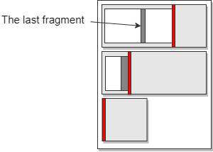

# Memory Lanes

[](https://github.com/arsuq/MemoryLanes/actions/workflows/dotnet.yml)

> v2.3

## Description 

The MemoryLanes library provides a simple API for using preallocated memory buffers, 
which could be stored on one of three locations:

* The managed heap
* The native heap
* A memory mapped file

A **MemoryLane** represents a buffer which is already allocated and can be sliced
on demand by reserving ranges in one direction only.
Consequently there is no search involved and the exact number of bytes is blocked, as long as 
the lane has enough free space. 


A **MemoryFragment** is a GC heap object created by the MemoryLane allocation function.
It holds the starting offset and the length of the buffer slice as well as a
destructor, injected by the Lane, which is triggered when the fragment is 
disposed. There is a common API for reading from and writing to the underlying
memory for all fragment types as well as a Span accessor. All fragments are implicitly 
cast-able to ```Span<T>``` and ```ReadOnlySpan<T>```. The *HeapFragment* has additional 
compatibility with ```Memory<T>```. All fragments support byte interpretation with the
 ```ToSpan<T>() ``` method as well as reads and writes for all primitive types, namely:
```bool, char, byte, short, ushort, int, uint, long, ulong, double, DateTime, Guid```

```csharp
public abstract class MemoryFragment : IDisposable
{
	public abstract int Write(byte[] data, int offset, int length);
	public abstract int Read(byte[] destination, int offset, int destOffset = 0);
	public abstract Span<byte> Span();
	public abstract int Length { get; }
	public abstract void Dispose();
	public abstract StorageType Type { get; } 
	public byte this[int index] { get; set; }
	public MemoryLane Lane { get; }
	public Span<T> ToSpan<T>() 
	public FragmentStream ToStream()
	...
	// Primitive reads and writes 
}
```

Similar to the thread stack deallocation, the MemoryLane cleanup is just an
offset reset, however that could only happen when there are no active fragments,
which means that the lifetime of the last fragment determines the reset time of the lane.
  


Due to the unpredictable fragment disposal time, using the lanes directly is not ideal.
A **MemoryCarriage** is a multi-lane allocator which is responsible for:

* allocating the requested slice on any lane, iterated in order 
* creating new lanes when there is no space in any of the current lanes


Depending on the actual memory storage location
one could use one of the following MemoryCarriage implementations:

* A **HeapHighway** - allocates memory on the managed heap
* A **MarshalHighway** - allocates a buffer on the native heap using the Marshal.AllocHGlobal()
* A **MappedHighway** - uses a memory mapped file as a storage   

or cast them to the **IMemoryHighway** interface:

```csharp
public interface IMemoryHighway : IDisposable
{
	MemoryFragment AllocFragment(int size, int tries);	
	MemoryLane this[int index] { get; }
	IReadOnlyList<MemoryLane> GetLanes();	
	int GetTotalActiveFragments();
	int GetTotalCapacity();
	int GetTotalFreeSpace();
	int GetLanesCount();
	int GetLastLaneIndex();
	long LastAllocTickAnyLane { get; }
	bool IsDisposed { get; }
	StorageType Type { get; }
}
```

There is also a **VirtualHighway**, which does not manage lanes, but creates either Heap or Marshal slots.


The default highway constructor will create two lanes - 8M and 4M in length. For a HeapHighway
one can avoid the LOH by configuring the initial lanes to be less than 80K in size, as well as the 
```DefaultLaneCapacity``` in the settings as it's the expansion length (see [expansion]).

All highways publicly expose their default layout as a static int[] array:

+ *HeapHighway* - DEF_HEAP_LANES
+ *MarshalHighway* - DEF_NHEAP_LANES
+ *MappedHighway* - DEF_MMF_LANES

These are used by the default ctor, so one could override the values and then use
the parameterless constructor. The ```HighwaySettings.DefaultLaneCapacity``` 
should also be changed if no settings instance is provided.


### Disposal


 The consumer *must* dispose all fragments in order to reset the lane. 
 The only other option to unfreeze a lane is to *Force()* reset it, which is unsafe.

 For fragments produced by a *VirtualHighway*, configured to use the managed heap, no
 disposal is required. 


## Usage

The original purpose of the lanes is message assembling in socket communication, which
demands quick memory allocation and release or a slow piece gathering. In most cases the received bytes are 
immediately converted into a managed heap object and then discarded. With proper framing 
one could make use of the different storage locations by using a heap highway for small messages
and a mapped highway when working with megabytes of data. 

> In general, one should think more about fragment lifetimes than size variety.


### Unpredictable fragment lifetime 

In order to reduce the probability of having a pinned lane, one may use dedicated highways or
highways with multiple short lanes, expecting long living fragments and infrequent resets.
That way the amount of locked bytes is constrained to a value that seems reasonable in the specific case.



Example: Two 8M lanes can be configured as 16x1M lanes or 4x512K + 4x1M + 3x2M + 1x4M etc.

### Highway structure

> This does not apply for virtual highways

Having more lanes in a highway is better for reducing the allocating threads competition.
The process is sequential and only one thread at a time can shift the lane offset. For minimal delays, one
should have multiple lanes and the *LaneAllocTries* set to a small value (less than 10). This controls the number 
timeouts to get a fragment (after the space check) before switching to a new lane, i.e. the number of times a competitor
thread allocated. Having high *LaneAllocTries* or awaitMS values helps for better data locality, but increases the 
waiting time. Small values disperse the allocations to other lanes but affect negatively the max-free-block space 
in the whole highway and waste more space. 

> If tries is 0, the settings' *LaneAllocTries* is used instead in ```Alloc(int size, int tries, int awaitMS)```

> The awaitMS allows one to wait longer for better data locality or
> skip a lane immediately ( tries = 1 and awaitMS = 0) if the allocation 
> delay must me minimized.

### Slots

In addition to the lanes API one could use the native heap directly through the 
**MarshalSlot** class. It is a MemoryFragment thus having the same Read/Write/Span
accessors, but it is not part of any lane and doesn't affect other fragments. 

Similarly, there is a **HeapSlot** fragment type, which is handy for reading and writing
primitives from/to a managed byte array. This is the easiest way to create a fragment.

> Note that if the HeapSlot is constructed with an external buffer (instead of length)
> its lifetime and data could be modified from outside. 


### Streams

Both the *MemoryFragment* and the *MemoryCarriage* (the Highways) have Stream facades, namely:
*FragmentStream* and *HighwayStream*. These are *System.IO.Stream* implementations operating on the
corresponding memory storage. One must be careful when using the *FragmentStream* as it has a fixed length.
The *HighwayStream* demands a fragment size in the constructor which will be the default expansion tile.
When more space is needed, more tiles are allocated, *Dispose()* resets the used fragments only.

Example: Serialize a managed object graph in IMemoryHighway.

```csharp
T obj;              // An object to serialize
IMemoryHighway hw;  // Any storage

using ( var hs = hw.CreateStream(TILE_SIZE) )
{
    var bf = new BinaryFormatter();
    bf.Serialize(hs, obj);

    // Use the bits
}
```


## Highway limits

The MemoryCarriage can be configured with an instance of the **HighwaySettings** class passed
in the constructor. The settings control the allocation limits, lane and highway retries, exception
handling, expansion and more.

```csharp
public class HighwaySettings
{
	public Func<bool> OnMaxLaneReached;
	public Func<bool> OnMaxTotalBytesReached;
	public Func<int, int> NextCapacity;

	public const int MAX_LANE_COUNT = 1_000_000;
	public const int MIN_LANE_CAPACITY = 1;
	public const int MAX_LANE_CAPACITY = 2_000_000_000;
	public const long MAX_HIGHWAY_CAPACITY = 200_000_000_000;

	public static int DefaultLaneCapacity = 8_000_000;
	public int LapsBeforeNewLane = 2;
	public int LaneAllocTries = 4;
	public int ConcurrentNewLaneAllocations = 1;
	public int NewLaneAllocationTimeoutMS = 3000;
	public bool RegisterForProcessExitCleanup = true;

	public readonly int DefaultCapacity;
	public readonly int MaxLanesCount;
	public readonly long MaxTotalAllocatedBytes;
}
```

The ```OnMaxLaneReached``` and ```OnMaxTotalBytesReached``` control whether the Highway will throw a 
MemoryLaneExcepton with codes *MaxLanesCountReached* or *MaxTotalAllocBytesReached*. 
When any of these thresholds is reached (MaxLanesCount or MaxTotalAllocatedBytes) by
default the corresponding error code is thrown. If the delegates are not null and return *true*
the allocation will simply fail, returning null instead of a fragment instance.

The ```LapsBeforeNewLane``` counts the Alloc failed loops through all lanes. When this value is
reached new lanes  will be allocated. The value of ```ConcurrentNewLaneAllocations``` limits
the max number of lane creation, by default is 1. This is a semaphore thus it will wait for 
```NewLaneAllocationTimeoutMS``` before bailing, after that the consumer will know that there is 
no free space from the returned null fragment reference.


### Size limits

One may notice that the buffer lengths are limited to Int32.MaxValue everywhere 
in the API, so one couldn't use a MappedHighway with 4GB mapped file.
The reason is having compatibility with the *Memory* and *Span* structs. 

> The MAX_LANE_COUNT is one million slots.


### Expansion

The highway shape can be controlled at construction time or later when expanding.
The new lane lengths can be specified with the *HighwaySettings* 
```Func<int, int> NextCapacity``` callback, which takes the current lane index and must return
the new lane size. 

> Note that the lane index is different than the lanes count. If some lanes are disposed or 
> closed manually the count will be less than the index, however the index helps preserving
> repeating size patterns. The actual opened lanes count can still be accessed from the callback
> with the highway's GetLanesCount() method if one needs it.  


## Types

> The library doesn't use own namespaces.


In **System**:

- HighwaySettings

- **Fragments**
  - MemoryFragment (abstract)
  - HeapFragment
  - MappedFragment
  - MarshalFragment
  - MarshalSlot
  - HeapSlot

- **Lanes**
  - MemoryLane (abstract)
  - HeapLane
  - MappedLane
  - MarshalLane
 
- **Highways**
  - MemoryCarriage (abstract)
  - IMemoryHighway (interface)
  - HeapHighway
  - MappedHighway
  - MarhsalHighway
  - VirtualHighway

- **Exceptions**
  - MemoryLaneException
  - InvariantException
  - SynchronizationException

In **System.IO**: 

- FragmentStream
- HighwayStream
- StreamExt

In **System.Collections.Concurrent**:

- [Tesseract](Tesseract.md)


