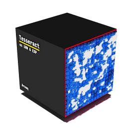





# Tesseract

The MemoryLanes lib uses a virtual array allowing **safe multi-threaded, indexed access** to its cells 
**while expanding**. The actual storage are four jagged arrays with a side of 256 slots
and total capacity of 2^31. It's constrained to reference types only for the atomic ops to work,
but one could use the ```TesseractCell<T>``` (T : struct) as a class wrapper. The Cell is implicitly
convertible from and to T.
 

## Accessors

The main accessors are:

| Method           | Description                                                     |
| ---------------- | --------------------------------------------------------------- |
| *Append*         | Adds an item and moves the AppendIndex, allocates if needed     |
| *Take*           | Replaces the cell value with a null and returns the original    |
| *RemoveLast*     | Like Append but decrements the AppendIndex                      |
| *CAS*            | Compare and exchange operation                                  |
| *get*            | Can read values up to the AllocatedSlots index                  |
| *set*            | Can set a cell if its index is less than AppendIndex            |
| *AppendIndex*    | The current position                                            |
| *AllocatedSlots* | The number of readable cells                                    |
| *ItemsCount*     | If CountNotNulls is true returns the total not-null cells count |
| *Clutch*         | Changes the TesseractGear (the Drive mode)                      |
| *Resize*         | Shrinks or expands explicitly                                   |
| *Format*         | Replaces all cells with an argument                             |
| *IndexOf*        | Searches for an object                                          |
| *Remove*         | Removes the cell at the IndexOf result                          |
| *NotNullItems*   | Enumerates the array and yields the cell if it's not null       |


## Drive

The cube supports different sets of concurrent operations at a time which can be observed as
the *Drive* property.

| TesseractGear | Allowed operations                                                        |
| ------------- | ------------------------------------------------------------------------- |
| *N*           | get, set, Take, CAS, NotNullItems, expand Resize, MoveAppendIndex, Format |
| *Straight*    | get, set, Take, CAS, NotNullItems, expand Resize, Append, (the default)   |
| *Reverse*     | get, set, Take, CAS, NotNullItems, expand Resize, RemoveLast              |
| *P*           | MoveAppendIndex, Resize                                                   |

The Drive can be changed by the *Clutch* method which is synchronized and will
block until all ongoing operations complete. 

## Internals

The ability to expand without copying data is in the predefined structure of the cube. 
The overhead is one reference for each SIDE (4096 bytes), the benefit is non blocking 
expansion and noticeable memory release if the GC decides to collect gen 2. 

The SIDE is a byte length for a reason. For quicker division and modular arithmetic it has to be
a power of two, so that right shift and bitwise AND can be used. 
However, the Tesseract indexing does not compute anything, it just interprets the four bytes of the
integer index as the direct 4D coordinates. 

### Locking

*Append* locks when expanding, otherwise it's just a few atomics. During allocation 
*Take*, *get*, *set* and the enumerator can safely traverse the array up to the *AppendIndex* position. 
The *Clutch*, *Resize* and *Format* lock, but they are semantically not concurrent. 
Everything else is lock free.

One may speed up the cube a bit by stopping the not-nulls counting in the ctor.
This feature (enabled with the default ctor) observes each cell modification and 
increments the total number of references if not null. At any point one may read 
the total objects count via the *ItemsCount* property. 

> The atomics cost increases with contention. One can verify this by benchmarking a
> preallocated Tesseract (will never lock) with an *empty* one. The lock acquiring plus
> the array allocation are nothing compared to the cache trashing penalty.

### Drive

Changing the gear demands external coordination. The first thing to note is that 
it's meant to wait for the ongoing operations to complete, not to block the new ones.
The latter would only delay the "Wrong drive" exceptions or suspend compatible ops
for no reason. 

In general one should treat the Drive as a read-only setting.


### Expansion

One could design a custom growth by providing a *TesseractExpansion* callback in the constructor.
Whenever more slots are needed it will be called with the current number of slots and the returned
new size will be allocated. The default behavior however (no callback) is much simpler - 
32xSIDE blocks are added at each allocation, i.e. 8192 slots.

> The default expansion count may seem too much, compared to a classic length doubling, 
> however it's actually more conservative after 10K when the 2x growth overcommits and locks
> huge memory blocks.

### Exceptions

If Append throws *OutOfMemoryException* exception or the user expansion callback throws, 
the *Drive* will be stuck in *Straight* position. Any ongoing *Clutch* calls will timeout 
(if set) or wait indefinitely. Except that all *Straight* methods will continue to work normally.

> Avoid try catch-ing in the TesseractExpansion callback as it is unnecessarily expensive
> in the context of a simple calculation such as AllocatedSlots * X.

One should expect *InvalidOperationException* in all accessors. This will be thrown
if the current Drive does not allow the operation. This exception has no effect on 
the cube state, i.e. it's normal and expected.


